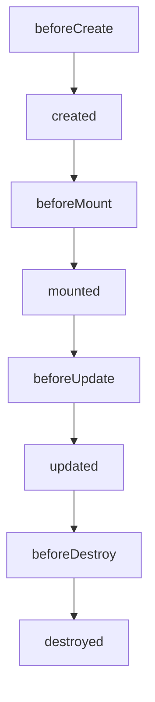

# VUE.JS

#1 *VUE CLI*

O Vue CLI (**Command Line Interface**) é uma ferramenta oficial para scaffolding e gerenciamento de projetos Vue.js. Ele simplifica o processo de configuração e desenvolvimento, oferecendo recursos poderosos para criar aplicações Vue.js modernas.

---

### **Principais Recursos do Vue CLI**

1. **Criação Rápida de Projetos:**
    - Permite inicializar projetos Vue.js com configurações predefinidas ou personalizadas.
    - Suporte para `Vue 2` e `Vue 3`.
    
    npm install -g @vue/cli 
    
    ```bash
    vue create nome-do-projeto
    
    ```
    
2. **Modo Interativo:**
    - Oferece um menu interativo para escolher opções como:
        - Gerenciador de pacotes (`npm` ou `yarn`).
        - Suporte a TypeScript, Vue Router, Vuex, PWA, entre outros.
        - Configuração de ESLint e Prettier.
3. **Plugin-Based Architecture:**
    - Plugins para adicionar funcionalidades como TypeScript, Router, Vuex, PWA, etc.
    - Você pode instalar plugins a qualquer momento.
    
    ```bash
    vue add router
    
    ```
    
4. **Hot Module Replacement (HMR):**
    - Durante o desenvolvimento, atualiza partes da aplicação sem recarregar a página inteira.
5. **Servidor de Desenvolvimento:**
    - Um servidor local para desenvolvimento com recarregamento automático.
    
    ```bash
    npm run serve
    
    ```
    
6. **Build Otimizado:**
    - Gera um build de produção altamente otimizado.
    
    ```bash
    npm run build
    
    ```
    
7. **Configuração via Arquivo:**
    - Suporte para customizações avançadas em um arquivo chamado `vue.config.js`.
8. **Vue UI:**
    - Interface gráfica para gerenciar projetos Vue.js, permitindo instalar plugins, configurar dependências e muito mais sem usar o terminal.
    
    ```bash
    vue ui
    
    ```
    

---

### **Como Instalar o Vue CLI**

Instale o Vue CLI globalmente usando o **npm** ou **yarn**:

```bash
npm install -g @vue/cli

```

---

### **Benefícios**

- Evita configuração manual de ferramentas como Webpack.
- Melhora a produtividade e reduz erros de configuração.
- Extensível com plugins e compatível com ecossistemas modernos.

 

#2 O *DATA BINDING*

---

O **data binding** em Vue.js é uma técnica para vincular dados do modelo (JavaScript) ao DOM (HTML) e vice-versa. Essa funcionalidade é essencial para criar interfaces dinâmicas e interativas, e pode ser de dois tipos principais: **binding unidirecional** e **binding bidirecional**.

---

### **1. Binding Unidirecional (`v-bind`)**

O **binding unidirecional** sincroniza os dados do modelo com o DOM, mas as mudanças no DOM não afetam o modelo.

### Exemplo:

```html
<div id="app">
  <p v-bind:title="message">Passe o mouse aqui para ver a mensagem.</p>
</div>

<script>
const app = new Vue({
  el: '#app',
  data: {
    message: 'Olá, Vue.js!'
  }
});
</script>

```

- O valor do atributo `title` é atualizado conforme o valor de `message` no modelo.

> Atalho: Você pode usar apenas : ao invés de v-bind, como em :title="message".
> 

---

### **2. Binding Bidirecional (`v-model`)**

O **binding bidirecional** sincroniza os dados do modelo com o DOM e vice-versa. É comumente usado em formulários.

### Exemplo:

```html
<div id="app">
  <input v-model="name" placeholder="Digite seu nome">
  <p>Olá, {{ name }}!</p>
</div>

<script>
const app = new Vue({
  el: '#app',
  data: {
    name: 'Joao Sapeca'
  }
});
</script>

```

- O campo de entrada está vinculado ao dado `name`. Qualquer alteração no input atualizará `name`, e vice-versa.

---

### **3. Interpolação (Binding Básico)**

A interpolação usa `{{ }}` para exibir os dados diretamente no DOM.

### Exemplo:

```html
<div id="app">
  <p>{{ message }}</p>
</div>

<script>
const app = new Vue({
  el: '#app',
  data: {
    message: 'Bem-vindo ao Vue.js!'
  }
});
</script>

```

---

### **4. Modificadores em `v-model`**

O `v-model` oferece modificadores úteis para controlar como os dados são manipulados.

### Exemplo:

```html
<div id="app">
  <input v-model.lazy="name" placeholder="Digite seu nome">
  <p>{{ name }}</p>
</div>

<script>
const app = new Vue({
  el: '#app',
  data: {
    name: ''
  }
});
</script>

```

- **`lazy`**: Atualiza o modelo somente quando o evento `change` dispara (em vez de `input`).
- **`number`**: Converte o valor para número.
- **`trim`**: Remove espaços em branco extras.

---

 

*#5 LIFECYCLE E HOOKS*

---

No Vue.js, **Lifecycle Hooks** (ou ganchos do ciclo de vida) são métodos que permitem executar código em diferentes estágios do ciclo de vida de um componente. Eles fornecem uma maneira de reagir a eventos como criação, atualização e destruição de um componente.

### **Ciclo de Vida do Componente Vue**

Um componente no Vue passa por várias etapas no seu ciclo de vida, como:

1. **Criação (Creation):** Quando o componente é inicializado.
2. **Montagem (Mounting):** Quando o componente é inserido no DOM.
3. **Atualização (Updating):** Quando as propriedades ou o estado reativo do componente mudam.
4. **Destruição (Destruction):** Quando o componente é removido do DOM.

---

### **Principais Lifecycle Hooks**

### 1. **Criação**

Estes hooks são chamados antes que o componente seja montado no DOM.

- **`beforeCreate()`**
    - Chamado antes da inicialização do componente.
    - `data`, `computed`, e `methods` ainda não estão disponíveis.
    - Usado raramente, mas pode ser útil para configurar algo antes da reatividade.
- **`created()`**
    - Chamado após a inicialização do componente.
    - `data`, `computed`, e `methods` estão disponíveis.
    - Ideal para inicializações, como chamadas de API ou configuração inicial.
    
    **Exemplo:**
    
    ```jsx
    created() {
      console.log('Componente criado!');
      this.inicializarApp();
    }
    
    ```
    

### 2. **Montagem**

Esses hooks são chamados quando o componente é anexado ao DOM.

- **`beforeMount()`**
    - Chamado antes de montar o DOM.
    - O template ainda não foi renderizado.
- **`mounted()`**
    - Chamado após o componente ser montado no DOM.
    - Ideal para manipulação direta do DOM ou integração com bibliotecas de terceiros.
    
    **Exemplo:**
    
    ```jsx
    mounted() {
      console.log('Componente montado no DOM');
      this.$refs.inputField.focus();
    }
    
    ```
    

### 3. **Atualização**

Esses hooks são chamados quando dados reativos do componente mudam.

- **`beforeUpdate()`**
    - Chamado antes do DOM ser atualizado.
    - Útil para verificar ou alterar algo antes da re-renderização.
- **`updated()`**
    - Chamado após o DOM ser atualizado.
    - Ideal para executar ações baseadas na renderização final.
    
    **Exemplo:**
    
    ```jsx
    updated() {
      console.log('O componente foi atualizado!');
    }
    
    ```
    

### 4. **Destruição**

Esses hooks são chamados quando o componente é removido do DOM.

- **`beforeDestroy()`**
    - Chamado antes do componente ser destruído.
    - Pode ser usado para limpar listeners, timers ou outras dependências.
- **`destroyed()`**
    - Chamado após o componente ser completamente destruído.
    - Não há mais acesso ao DOM ou dados do componente.
    
    **Exemplo:**
    
    ```jsx
    beforeDestroy() {
      console.log('Componente será destruído!');
      clearInterval(this.timer);
    }
    
    ```
    

---

### **Fluxo do Ciclo de Vida**

O ciclo de vida de um componente segue esta sequência:

1. **Criação:**
    - `beforeCreate()` → `created()`
2. **Montagem:**
    - `beforeMount()` → `mounted()`
3. **Atualização (quando reativo):**
    - `beforeUpdate()` → `updated()`
4. **Destruição:**
    - `beforeDestroy()` → `destroyed()`

---

### **Visualização do Ciclo de Vida**



---

### **Dicas para Usar Lifecycle Hooks**

1. **`created()`**:
    - Ideal para chamadas de API e configuração inicial.
2. **`mounted()`**:
    - Use para manipulação direta do DOM ou bibliotecas externas.
3. **`updated()`**:
    - Cuidado com loops infinitos; evite alterar dados reativos diretamente neste hook.
4. **`beforeDestroy()`**:
    - Certifique-se de limpar recursos como timers, eventos ou listeners.

---

 

 *#6  Hierarquia de componentes*

---

A **hierarquia de componentes** no Vue.js refere-se à organização e estruturação dos componentes dentro de uma aplicação. Ela determina como os componentes se relacionam e comunicam uns com os outros.

No Vue.js, a hierarquia segue uma estrutura de **árvore**, onde:

1. Há um **componente raiz** (geralmente o `App.vue`).
2. Esse componente possui **filhos**, que podem ter **subcomponentes**.

---

### **Estrutura de Hierarquia de Componentes**

Aqui está um exemplo básico de como os componentes podem ser organizados:

```
App.vue
├── Header.vue
├── Footer.vue
└── Main.vue
    ├── Sidebar.vue
    └── Content.vue
        ├── Card.vue
        └── Button.vue

```

- **App.vue**: O componente raiz, que organiza os outros componentes.
- **Header.vue**, **Footer.vue**, **Main.vue**: Componentes de nível superior (filhos diretos de `App.vue`).
- **Sidebar.vue**, **Content.vue**: Subcomponentes que organizam partes mais específicas da interface.
- **Card.vue**, **Button.vue**: Componentes mais granulares reutilizáveis.

---

### **Criação e Importação de Componentes**

Para criar um componente e utilizá-lo dentro de outro:

### 1. Criando o Componente Filho (`Button.vue`):

```
<template>
  <button class="btn">{{ label }}</button>
</template>

<script>
export default {
  name: 'Button',
  props: {
    label: {
      type: String,
      required: true
    }
  }
};
</script>

```

### 2. Importando no Componente Pai (`Card.vue`):

```
<template>
  <div class="card">
    <p>Este é um card.</p>
    <Button label="Clique Aqui" />
  </div>
</template>

<script>
import Button from './Button.vue';

export default {
  name: 'Card',
  components: {
    Button
  }
};
</script>

```

### 3. Utilizando no Componente Superior (`Content.vue`):

```
<template>
  <div>
    <h2>Conteúdo Principal</h2>
    <Card />
  </div>
</template>

<script>
import Card from './Card.vue';

export default {
  name: 'Content',
  components: {
    Card
  }
};
</script>

```

---

### **Comunicação na Hierarquia**

### 1. **De Pai para Filho (Props):**

O componente pai pode passar dados para o filho usando **props**.

Exemplo (`App.vue`):

```
<template>
  <Header title="Bem-vindo ao Vue.js" />
</template>

<script>
import Header from './Header.vue';

export default {
  components: {
    Header
  }
};
</script>

```

Exemplo (`Header.vue`):

```
<template>
  <h1>{{ title }}</h1>
</template>

<script>
export default {
  props: {
    title: String
  }
};
</script>

```

---

### 2. **De Filho para Pai (Eventos):**

Um componente filho pode emitir eventos para o pai usando **`$emit`**.

Exemplo (`Button.vue`):

```
<template>
  <button @click="$emit('clicked')">Clique Aqui</button>
</template>

```

Exemplo (`Card.vue`):

```
<template>
  <Button @clicked="handleClick" />
</template>

<script>
import Button from './Button.vue';

export default {
  components: {
    Button
  },
  methods: {
    handleClick() {
      console.log('Botão clicado!');
    }
  }
};
</script>

```

---

### 3. **Comunicação entre Irmãos:**

Para compartilhar dados entre componentes irmãos, você pode usar um **store** (ex.: Vuex ou Pinia) ou um **event bus**.

---

### **Reutilização de Componentes**

1. **Granularidade:** Crie componentes menores que podem ser reutilizados em diferentes partes do sistema, como botões ou inputs.
2. **Isolamento:** Certifique-se de que os componentes sejam independentes e recebam todos os dados necessários via props.

---

 ***Conhecendo as diretivas (v-if, v-show, v-for)***

As **diretivas** no Vue.js são atributos especiais adicionados a elementos HTML que permitem manipular o DOM de forma declarativa. Elas começam com o prefixo **`v-`** e são essenciais para interagir com o comportamento reativo do Vue.

A seguir, apresento as três diretivas mais usadas no desenvolvimento: **`v-if`**, **`v-show`** e **`v-for`**.

---

### **1. `v-if` (Renderização Condicional)**

A diretiva **`v-if`** renderiza um elemento no DOM somente se a expressão fornecida for avaliada como **`true`**.

### Exemplo:

```
<template>
  <div>
    <p v-if="mostrarMensagem">Olá, Vue.js!</p>
    <p v-else>Mensagem não disponível</p>
  </div>
</template>

<script>
export default {
  data() {
    return {
      mostrarMensagem: true
    };
  }
};
</script>

```

- **`v-if`**: Renderiza o elemento apenas se a condição for verdadeira.
- **`v-else`**: Define o que será exibido quando a condição do `v-if` for falsa.

### Pontos importantes:

- Elementos com **`v-if`** são criados ou destruídos do DOM, o que pode ter impacto no desempenho quando usado em listas grandes.
- Para condições múltiplas, use **`v-else-if`**.

---

### **2. `v-show` (Exibição Condicional)**

A diretiva **`v-show`** controla a visibilidade do elemento através do estilo **CSS** (`display: none`), sem removê-lo do DOM.

### Exemplo:

```
<template>
  <div>
    <p v-show="mostrarMensagem">Este elemento está visível.</p>
  </div>
</template>

<script>
export default {
  data() {
    return {
      mostrarMensagem: true
    };
  }
};
</script>

```

- Com **`v-show`**, o elemento permanece no DOM, mas é ocultado ou mostrado com base na condição.

### Diferenças entre `v-if` e `v-show`:

| **`v-if`** | **`v-show`** |
| --- | --- |
| Remove o elemento do DOM. | Apenas oculta no DOM. |
| Mais custoso para renderizar. | Mais eficiente para trocar visibilidade. |
| Útil para condições raramente mudadas. | Útil para alternâncias frequentes. |

---

### **3. `v-for` (Renderização de Listas)**

A diretiva **`v-for`** é usada para renderizar uma lista de elementos com base em um array ou objeto.

### Exemplo com Arrays:

```
<template>
  <ul>
    <li v-for="(item, index) in itens" :key="index">
      {{ index + 1 }}. {{ item }}
    </li>
  </ul>
</template>

<script>
export default {
  data() {
    return {
      itens: ['Maçã', 'Banana', 'Laranja']
    };
  }
};
</script>

```

- **`in itens`**: Itera sobre o array `itens`.
- **`(item, index)`**: Você pode acessar o elemento atual (`item`) e o índice (`index`).
- **`:key`**: A propriedade `key` ajuda o Vue a rastrear os elementos de forma eficiente. Sempre use um identificador único.

### Exemplo com Objetos:

```
<template>
  <ul>
    <li v-for="(valor, chave) in objeto" :key="chave">
      {{ chave }}: {{ valor }}
    </li>
  </ul>
</template>

<script>
export default {
  data() {
    return {
      objeto: { nome: 'João', idade: 25, cidade: 'São Paulo' }
    };
  }
};
</script>

```

- **`(valor, chave)`**: Você pode acessar o valor e a chave de cada entrada no objeto.

### Exemplo com Números:

```
<template>
  <div>
    <p v-for="n in 5" :key="n">Número: {{ n }}</p>
  </div>
</template>

```

- Renderiza os números de **1 a 5**.

---

### **Resumo**

| **Diretiva** | **Uso Principal** | **Exemplo** |
| --- | --- | --- |
| **`v-if`** | Renderiza condicionalmente, criando ou destruindo elementos do DOM. | `<p v-if="mostrar">Texto</p>` |
| **`v-show`** | Alterna visibilidade sem remover o elemento do DOM. | `<p v-show="mostrar">Texto</p>` |
| **`v-for`** | Itera sobre arrays, objetos ou números para renderizar listas. | `<li v-for="item in itens">{{ item }}</li>` |

---

 *#7 EXPRESSÕES NO DATA BINDING*

---

No Vue.js, as **expressões no Data Binding** permitem integrar lógica diretamente no HTML para exibir dados ou reagir a mudanças no estado de maneira dinâmica. Elas são usadas principalmente dentro da diretiva **`v-bind`** ou interpolações (`{{ }}`) no template.

---

### **Interpolação no Template**

A forma mais simples de usar expressões no Data Binding é por meio de interpolação, que insere valores de variáveis diretamente no HTML.

### Exemplo Básico:

```
<template>
  <div>
    <p>Olá, {{ nome }}!</p>
    <p>Ano atual: {{ new Date().getFullYear() }}</p>
  </div>
</template>

<script>
export default {
  data() {
    return {
      nome: 'João'
    };
  }
};
</script>

```

- **`{{ nome }}`**: Exibe o valor da propriedade `nome`.
- **`{{ new Date().getFullYear() }}`**: Executa uma expressão JavaScript diretamente na interpolação.

---

### **Usando `v-bind` para Atributos**

A diretiva **`v-bind`** permite vincular atributos HTML a dados reativos ou expressões.

### Exemplo com `v-bind`:

```
<template>
  <div>
    
    <a :href="link" :title="'Ir para ' + descricao">Clique aqui</a>
  </div>
</template>

<script>
export default {
  data() {
    return {
      imagemUrl: 'https://via.placeholder.com/150',
      descricao: 'um exemplo',
      link: 'https://www.example.com'
    };
  }
};
</script>

```

- **`:src="imagemUrl"`**: Vincula o atributo `src` à propriedade `imagemUrl`.
- **`:title="'Ir para ' + descricao"`**: Concatena strings para criar dinamicamente o título.

---

### **Operadores e Lógica nas Expressões**

É possível usar operadores e expressões JavaScript simples diretamente nas interpolações e bindings.

### Exemplo:

```
<template>
  <div>
    <p>{{ contador * 2 }}</p>
    <p>{{ mensagem.toUpperCase() }}</p>
    <p>{{ mostrar ? 'Visível' : 'Oculto' }}</p>
  </div>
</template>

<script>
export default {
  data() {
    return {
      contador: 5,
      mensagem: 'Olá, Vue.js!',
      mostrar: true
    };
  }
};
</script>

```

- **`{{ contador * 2 }}`**: Realiza cálculos matemáticos diretamente.
- **`{{ mensagem.toUpperCase() }}`**: Chama métodos nativos de JavaScript.
- **`{{ mostrar ? 'Visível' : 'Oculto' }}`**: Usa operadores ternários.

---

### **Restrições das Expressões**

Embora expressões JavaScript sejam permitidas, existem limitações para garantir que o template permaneça simples e legível:

1. **Permitido:**
    - Operadores básicos (ex.: `+`, ``, `&&`, `||`).
    - Métodos nativos (ex.: `toUpperCase()`, `slice()`, `Math.random()`).
    - Chamadas a métodos declarados no componente.
2. **Não permitido:**
    - Expressões complexas ou múltiplas instruções (ex.: loops ou declarações `if`).
    - Atribuições (ex.: `contador = contador + 1`).
    
    **Exemplo de uso inválido:**
    
    ```
    <p>{{ if (mostrar) { return 'Visível'; } }}</p> <!-- Não permitido -->
    
    ```
    

---

### **Interpolação vs `v-bind`**

| **Interpolação (`{{ }}`)** | **`v-bind`** |
| --- | --- |
| Usada dentro de texto ou conteúdo HTML. | Usada para atributos HTML e DOM. |
| Não funciona para atributos. | Vincula diretamente atributos e propriedades. |

### Exemplo Comparativo:

```
<template>
  <div>
    <!-- Interpolação -->
    <p>Olá, {{ nome }}</p>

    <!-- v-bind -->
    
  </div>
</template>

<script>
export default {
  data() {
    return {
      nome: 'João',
      imagemUrl: 'https://via.placeholder.com/150'
    };
  }
};
</script>

```

---

 


 *#8 V-On - Implementando modificadores*

---

No Vue.js, a diretiva **`v-on`** permite a escuta de eventos DOM, e os **modificadores** são sufixos que ajustam ou refinam o comportamento dos eventos. Isso evita que você precise escrever lógica repetitiva nos métodos, deixando o código mais limpo e eficiente.

---

## **Modificadores mais comuns do `v-on`**

### 1. **`.prevent`** - Evita o comportamento padrão do evento

Esse modificador impede que a ação padrão do navegador seja executada, como no envio de formulários.

### Exemplo:

```
<template>
  <form @submit.prevent="enviarFormulario">
    <button type="submit">Enviar</button>
  </form>
</template>

<script>
export default {
  methods: {
    enviarFormulario() {
      alert('Formulário processado sem recarregar a página!');
    }
  }
};
</script>

```

- **`@submit.prevent`**: Evita o envio tradicional do formulário que recarregaria a página.

---

### 2. **`.stop`** - Impede a propagação do evento

Esse modificador evita que o evento se propague para elementos ancestrais (pais).

### Exemplo:

```
<template>
  <div @click="paiClicado">
    <button @click.stop="botaoClicado">Clique no botão</button>
  </div>
</template>

<script>
export default {
  methods: {
    paiClicado() {
      alert('Evento no elemento pai!');
    },
    botaoClicado() {
      alert('Evento no botão!');
    }
  }
};
</script>

```

- **`@click.stop`**: O evento de clique **não se propagará** para o elemento pai `<div>`.

---

### 3. **`.once`** - Evento disparado apenas uma vez

Esse modificador faz com que o evento seja executado **apenas uma vez**, mesmo que o usuário continue interagindo.

### Exemplo:

```
<template>
  <button @click.once="executarUmaVez">Clique uma vez</button>
</template>

<script>
export default {
  methods: {
    executarUmaVez() {
      alert('Este evento será executado apenas uma vez!');
    }
  }
};
</script>

```

- **`@click.once`**: A função `executarUmaVez` só será chamada na **primeira interação**.

---

### 4. **`.self`** - Evento disparado apenas no elemento atual

Esse modificador garante que o evento só será acionado se ocorrer **no elemento em si**, e não nos seus filhos.

### Exemplo:

```
<template>
  <div @click.self="divClicada">
    <p>Clique aqui (não dispara o evento da div)</p>
  </div>
</template>

<script>
export default {
  methods: {
    divClicada() {
      alert('Div clicada, ignorando elementos filhos!');
    }
  }
};
</script>

```

- **`@click.self`**: Ignora os cliques nos elementos filhos (`<p>` neste caso).

---

### 5. **`.capture`** - Captura o evento antes dos elementos filhos

O modificador **`capture`** altera a ordem do evento, forçando que o elemento pai capture o evento **antes** dos elementos filhos.

### Exemplo:

```
<template>
  <div @click.capture="paiCapturado">
    <button @click="botaoClicado">Clique no botão</button>
  </div>
</template>

<script>
export default {
  methods: {
    paiCapturado() {
      alert('Evento capturado pelo pai primeiro!');
    },
    botaoClicado() {
      alert('Evento do botão!');
    }
  }
};
</script>

```

- **`@click.capture`**: O evento do `div` é processado **antes** do botão, independentemente da hierarquia no DOM.

---

### 6. **`.passive`** - Melhora desempenho ignorando `preventDefault()`

O modificador **`.passive`** é usado para otimizar eventos de rolagem (`scroll`) ou toques (`touch`), garantindo que o evento seja tratado de forma não bloqueante.

### Exemplo:

```
<template>
  <div @scroll.passive="onScroll" style="height: 200px; overflow-y: scroll;">
    <p v-for="n in 50" :key="n">Item {{ n }}</p>
  </div>
</template>

<script>
export default {
  methods: {
    onScroll() {
      console.log('Rolando...');
    }
  }
};
</script>

```

- **`@scroll.passive`**: Melhora o desempenho de rolagem, pois o navegador não espera o JavaScript terminar.

---

### 7. **Combinação de Modificadores**

Os modificadores podem ser **combinados** para obter comportamentos mais complexos.

### Exemplo:

```
<template>
  <button @click.stop.prevent.once="acaoBotao">Clique aqui</button>
</template>

<script>
export default {
  methods: {
    acaoBotao() {
      alert('Botão clicado: apenas uma vez, sem propagação e com comportamento padrão prevenido!');
    }
  }
};
</script>

```

- **`@click.stop.prevent.once`**:
    1. **`.stop`**: Impede propagação do evento.
    2. **`.prevent`**: Evita comportamento padrão.
    3. **`.once`**: Executa apenas uma vez.

---

## **Tabela Resumo de Modificadores do `v-on`**

| **Modificador** | **Descrição** | **Exemplo** |
| --- | --- | --- |
| `.prevent` | Impede a ação padrão do navegador. | `@submit.prevent` |
| `.stop` | Impede a propagação do evento para elementos pais. | `@click.stop` |
| `.once` | Executa o evento apenas uma vez. | `@click.once` |
| `.self` | Dispara o evento apenas no próprio elemento, não nos filhos. | `@click.self` |
| `.capture` | Captura o evento na fase de captura (antes dos filhos). | `@click.capture` |
| `.passive` | Melhora desempenho ignorando `preventDefault`. | `@scroll.passive` |

---

## **Conclusão**

Os modificadores do **`v-on`** simplificam a manipulação de eventos DOM e eliminam a necessidade de lógica repetitiva no código. Eles tornam o desenvolvimento mais rápido, eficiente e legível.

*#9 Multiplos Eventos*

---

No Vue.js, você pode associar **múltiplos eventos** a elementos no template usando o modificador `v-on` ou seus atalhos. Isso é útil para acionar diferentes ações com base em vários tipos de interação ou para combinar lógica em eventos distintos.

---

## **Métodos separados para diferentes eventos**

Você pode lidar com eventos diferentes no mesmo elemento, mas cada evento acionará um método específico.

### Exemplo:

```
<template>
  <div>
    <button
      @click="clicar"
      @mouseover="apenasPassarMouse">
      Clique ou Passe o Mouse
    </button>
  </div>
</template>

<script>
export default {
  methods: {
    clicar() {
      alert("Você clicou no botão!");
    },
    apenasPassarMouse() {
      console.log("O mouse passou sobre o botão!");
    }
  }
};
</script>

```

- **`@click`**: Lida com cliques no botão.
- **`@mouseover`**: Lida com a passagem do mouse sobre o botão.

---

## **Chamando múltiplos métodos em um único evento**

Se você deseja executar **vários métodos** com base em um único evento (como `click`), pode chamá-los diretamente no template.

### Exemplo:

```
<template>
  <button @click="primeiraAcao(); segundaAcao();">
    Clique aqui
  </button>
</template>

<script>
export default {
  methods: {
    primeiraAcao() {
      console.log("Primeira ação executada!");
    },
    segundaAcao() {
      console.log("Segunda ação executada!");
    }
  }
};
</script>

```

---

## **Múltiplos eventos com `v-on` usando objeto**

Outra maneira eficiente de lidar com múltiplos eventos é usar um **objeto de eventos**. Isso permite que você associe vários eventos e métodos em um único `v-on`.

### Exemplo:

```
<template>
  <div>
    <button v-on="{ click: clicar, mouseover: passarMouse }">
      Clique ou Passe o Mouse
    </button>
  </div>
</template>

<script>
export default {
  methods: {
    clicar() {
      alert("Você clicou!");
    },
    passarMouse() {
      console.log("Mouse sobre o botão!");
    }
  }
};
</script>

```

- **Vantagem**: Mantém o código limpo e organizado, especialmente se houver muitos eventos no mesmo elemento.

---

## **Eventos com modificadores**

Você pode combinar múltiplos eventos e ainda adicionar **modificadores** para ajustar o comportamento.

### Exemplo com modificadores:

```
<template>
  <input
    @focus="focado"
    @blur="perdeuFoco"
    @keydown.enter="enviarMensagem">
</template>

<script>
export default {
  methods: {
    focado() {
      console.log("O campo foi focado!");
    },
    perdeuFoco() {
      console.log("O campo perdeu o foco.");
    },
    enviarMensagem() {
      console.log("Enter pressionado. Enviando mensagem...");
    }
  }
};
</script>

```

---

## **Múltiplos eventos e parâmetros**

Você também pode passar **parâmetros** para diferentes métodos ao tratar múltiplos eventos.

### Exemplo:

```
<template>
  <div>
    <button
      @click="acao('clicar')"
      @mouseover="acao('mouse')">
      Clique ou Passe o Mouse
    </button>
  </div>
</template>

<script>
export default {
  methods: {
    acao(tipo) {
      if (tipo === 'clicar') {
        alert("Você clicou!");
      } else if (tipo === 'mouse') {
        console.log("O mouse passou por aqui!");
      }
    }
  }
};
</script>

```

---

## **Usando o `.native` em componentes**

Se você estiver usando um componente personalizado e quiser escutar eventos no **elemento raiz do componente**, use o modificador **`.native`**.

### Exemplo:

```
<template>
  <div>
    <meu-componente @click.native="componenteClicado" />
  </div>
</template>

<script>
export default {
  methods: {
    componenteClicado() {
      alert("Você clicou no componente!");
    }
  }
};
</script>

```

---

## **Conclusão**

Com essas técnicas, você pode lidar eficientemente com múltiplos eventos em Vue.js, seja para executar diferentes ações ou organizar sua lógica. 

 


#10 Diretivas V-if , V-Else e V-show

---

As **diretivas** no Vue.js são atributos especiais que aplicam comportamento reativo e dinâmico aos elementos do DOM. Algumas das diretivas mais usadas incluem:

---

## **1. `v-if` (Renderização condicional)**

A diretiva **`v-if`** é usada para **exibir ou ocultar** elementos do DOM com base em uma expressão booleana. Se a expressão for **falsa**, o elemento é completamente **removido do DOM**.

### Exemplo:

```
<template>
  <div>
    <p v-if="mostrar">Este parágrafo será exibido se 'mostrar' for verdadeiro.</p>
    <button @click="alternar">Alternar</button>
  </div>
</template>

<script>
export default {
  data() {
    return {
      mostrar: true,
    };
  },
  methods: {
    alternar() {
      this.mostrar = !this.mostrar;
    }
  }
};
</script>

```

- **`v-if="mostrar"`**: Renderiza o parágrafo apenas quando `mostrar` for **true**.
- **Vantagem**: Elementos são completamente **removidos** ou **adicionados ao DOM**, economizando recursos.

### **`v-else` e `v-else-if`**

Essas diretivas podem ser usadas para **casos alternativos**.

```
<template>
  <div>
    <p v-if="status === 'ativo'">Usuário ativo</p>
    <p v-else-if="status === 'inativo'">Usuário inativo</p>
    <p v-else>Estado desconhecido</p>
  </div>
</template>

<script>
export default {
  data() {
    return {
      status: 'ativo', // Mude para 'inativo' ou qualquer outro valor para testar
    };
  }
};
</script>

```

---

## **2. `v-show` (Exibição condicional)**

A diretiva **`v-show`** também é usada para **exibir ou ocultar** elementos com base em uma expressão booleana. No entanto, em vez de **remover o elemento do DOM**, ela usa a propriedade **CSS `display: none`** para escondê-lo.

### Exemplo:

```
<template>
  <div>
    <p v-show="mostrar">Este parágrafo será exibido se 'mostrar' for verdadeiro.</p>
    <button @click="alternar">Alternar</button>
  </div>
</template>

<script>
export default {
  data() {
    return {
      mostrar: true,
    };
  },
  methods: {
    alternar() {
      this.mostrar = !this.mostrar;
    }
  }
};
</script>

```

- **Diferença entre `v-if` e `v-show`**:
    - **`v-if`**: Remove e adiciona elementos ao DOM, ideal para condições dinâmicas que mudam raramente.
    - **`v-show`**: Apenas alterna a visibilidade, mantendo o elemento no DOM, melhor para alternâncias frequentes.

---

## **3. `v-for` (Renderização de listas)**

A diretiva **`v-for`** é usada para **iterar sobre listas** e **renderizar elementos dinamicamente** com base em cada item.

### Exemplo básico:

```
<template>
  <ul>
    <li v-for="(item, index) in itens" :key="index">
      {{ index + 1 }}. {{ item }}
    </li>
  </ul>
</template>

<script>
export default {
  data() {
    return {
      itens: ['Maçã', 'Banana', 'Cereja'],
    };
  }
};
</script>

```

- **`v-for="(item, index) in itens"`**: Itera sobre a lista `itens`.
    - `item`: Representa o valor de cada elemento.
    - `index`: Representa o índice do elemento atual.
- **`:key`**: Usado para identificar de forma única cada item (melhora o desempenho e evita erros ao renderizar listas).

### Iterando sobre objetos:

```
<template>
  <div>
    <p v-for="(valor, chave) in usuario" :key="chave">
      {{ chave }}: {{ valor }}
    </p>
  </div>
</template>

<script>
export default {
  data() {
    return {
      usuario: { nome: 'João', idade: 25, cidade: 'São Paulo' },
    };
  }
};
</script>

```

- **`(valor, chave)`**: Itera sobre as propriedades de um objeto.

---

## **Comparação rápida: `v-if` vs `v-show`**

| **Critério** | **`v-if`** | **`v-show`** |
| --- | --- | --- |
| **Comportamento** | Remove/adiciona elementos no DOM | Usa `display: none` no CSS |
| **Uso ideal** | Para renderização condicional rara | Para alternância frequente |
| **Custo de desempenho** | Maior, devido à manipulação do DOM | Menor, apenas altera o estilo |

---

## **Diretivas combinadas**

As diretivas podem ser usadas juntas para criar comportamentos dinâmicos e complexos.

### Exemplo:

```
<template>
  <div>
    <p v-if="itens.length > 0">Lista de itens:</p>
    <ul>
      <li v-for="(item, index) in itens" :key="index" v-show="mostrar">
        {{ item }}
      </li>
    </ul>
    <button @click="alternar">Mostrar/Ocultar itens</button>
  </div>
</template>

<script>
export default {
  data() {
    return {
      itens: ['Item 1', 'Item 2', 'Item 3'],
      mostrar: true,
    };
  },
  methods: {
    alternar() {
      this.mostrar = !this.mostrar;
    }
  }
};
</script>

```

- **`v-if="itens.length > 0"`**: Exibe o título apenas se houver itens na lista.
- **`v-for`**: Itera sobre os itens para renderizá-los.
- **`v-show="mostrar"`**: Alterna a visibilidade dos itens.

---

 

*Métodos*

---

Em Vue.js, os **métodos** são funções definidas na propriedade **`methods`** de um componente. Eles são usados para executar ações em resposta a eventos, manipular dados ou realizar qualquer lógica personalizada.

---

## **Como definir métodos**

Os métodos são declarados como funções dentro da propriedade **`methods`**. Eles podem ser chamados diretamente em templates ou por outros métodos.

### Exemplo básico:

```
<template>
  <div>
    <p>{{ mensagem }}</p>
    <button @click="alterarMensagem">Clique aqui</button>
  </div>
</template>

<script>
export default {
  data() {
    return {
      mensagem: "Olá, Vue.js!"
    };
  },
  methods: {
    alterarMensagem() {
      this.mensagem = "Mensagem alterada com sucesso!";
    }
  }
};
</script>

```

### Explicação:

1. **`@click="alterarMensagem"`**: Associa o evento de clique ao método `alterarMensagem`.
2. **`alterarMensagem`**: Um método que altera o valor de `mensagem` no estado do componente.

---

## **Reatividade nos métodos**

Os métodos podem interagir diretamente com os dados reativos definidos no objeto `data`. Qualquer alteração feita pelos métodos será automaticamente refletida no DOM.

---

## **Chamando métodos com parâmetros**

Você pode passar parâmetros para os métodos diretamente do template.

### Exemplo:

```
<template>
  <div>
    <button @click="saudar('João')">Saudar João</button>
    <button @click="saudar('Maria')">Saudar Maria</button>
  </div>
</template>

<script>
export default {
  methods: {
    saudar(nome) {
      alert(`Olá, ${nome}!`);
    }
  }
};
</script>

```

---

## **Diferença entre Métodos e Computed Properties**

Embora os **métodos** possam ser usados para manipular e retornar valores, há diferenças importantes entre eles e as **computed properties**:

| **Critério** | **Métodos** | **Computed Properties** |
| --- | --- | --- |
| **Chamada** | Executados toda vez que chamados | Somente recalculados quando dependências mudam |
| **Uso típico** | Lógica e interações eventuais | Transformação de dados derivada |
| **Desempenho** | Pode ser menos eficiente se chamado várias vezes sem necessidade | Mais eficiente devido ao cache automático |

---

## **Usando métodos para eventos personalizados**

Métodos são úteis para manipular **eventos personalizados** emitidos pelos componentes filhos.

### Exemplo com eventos personalizados:

```
<template>
  <div>
    <meu-componente @evento-personalizado="lidarComEvento" />
  </div>
</template>

<script>
export default {
  methods: {
    lidarComEvento(dado) {
      console.log("Evento recebido:", dado);
    }
  }
};
</script>

```

---

## **Organizando métodos complexos**

Em aplicações maiores, mantenha os métodos simples e, se necessário, separe a lógica em funções externas ou módulos para melhorar a legibilidade e a manutenção

---

*#11 - Css scoped e Css Global*

O Vue.js oferece suporte para aplicar estilos CSS tanto no **escopo global** quanto no **escopo de um componente específico**. Isso é feito para facilitar o isolamento dos estilos em componentes e evitar conflitos de estilos em projetos maiores.

---

## **1. CSS Scoped (Estilos escopados)**

Quando um estilo é declarado como "escopado" usando o atributo **`scoped`** no elemento `<style>`, ele será aplicado **apenas ao componente atual**. O Vue usa um mecanismo que adiciona identificadores exclusivos aos elementos HTML do componente para garantir o isolamento dos estilos.

### Exemplo:

```
<template>
  <div class="box">
    <p>Texto estilizado apenas neste componente.</p>
  </div>
</template>

<style scoped>
.box {
  background-color: lightblue;
  padding: 20px;
  border: 1px solid #ccc;
}
</style>

```

- **Isolamento**: O estilo acima não afetará outros componentes que tenham uma classe `.box`.
- **Uso ideal**: Para componentes que possuem estilos específicos e não devem interferir em outros componentes.

---

### **Como funciona o CSS Scoped**

O Vue transforma os seletores no CSS para que fiquem específicos ao componente, adicionando um atributo como `data-v-xxxx` ao HTML e aos seletores no CSS.

### HTML gerado:

```html
<div class="box" data-v-abc123>
  <p data-v-abc123>Texto estilizado apenas neste componente.</p>
</div>

```

### CSS transformado:

```css
.box[data-v-abc123] {
  background-color: lightblue;
  padding: 20px;
  border: 1px solid #ccc;
}

```

---

## **2. CSS Global**

Quando os estilos são declarados sem o atributo **`scoped`**, eles são aplicados de forma **global** a toda a aplicação. Esses estilos podem afetar qualquer elemento do DOM, independentemente do componente.

### Exemplo:

```
<template>
  <div class="box">
    <p>Texto estilizado globalmente.</p>
  </div>
</template>

<style>
.box {
  background-color: lightgreen;
  padding: 20px;
  border: 1px solid #ccc;
}
</style>

```

- **Alcance**: O estilo acima será aplicado a qualquer elemento com a classe `.box` em toda a aplicação.
- **Uso ideal**: Para estilos que devem ser reutilizados em vários componentes ou para estilizar elementos básicos (como um reset de CSS).

---

## **Comparação entre CSS Scoped e Global**

| **Critério** | **CSS Scoped** | **CSS Global** |
| --- | --- | --- |
| **Alcance** | Restringe estilos ao componente atual | Aplica estilos globalmente |
| **Isolamento** | Evita conflitos entre componentes | Pode causar conflitos de estilos |
| **Complexidade** | Requer manipulação interna de atributos | Simples, direto, como em projetos HTML tradicionais |
| **Uso ideal** | Estilos específicos para componentes isolados | Estilos reutilizáveis ou genéricos |

---

## **Estilizando Global e Scoped no mesmo componente**

Você pode combinar estilos globais e escopados em um mesmo componente. Para isso, basta usar múltiplas tags `<style>`.

### Exemplo:

```
<template>
  <div>
    <h1 class="titulo-global">Título global</h1>
    <p class="paragrafo-local">Parágrafo escopado</p>
  </div>
</template>

<style>
.titulo-global {
  color: blue;
  font-size: 24px;
}
</style>

<style scoped>
.paragrafo-local {
  color: red;
  font-size: 18px;
}
</style>

```

---

## **Dica: Estilos em Component Libraries**

1. **Scoped**: Ideal para bibliotecas de componentes isolados, onde cada componente tem seus próprios estilos.
2. **Global**: Útil para criar temas ou estilizações que serão aplicadas a toda a aplicação, como fontes ou cores.

---

 #12 - *Utilizando Props*

---

No Vue.js, as **props** (propriedades) são uma maneira de passar dados de um componente pai para um componente filho. Elas permitem que o componente filho seja reutilizável, dinâmico e personalizado.

---

## **Como usar Props**

### Passo 1: Declarar Props no Componente Filho

No componente filho, declare as props no objeto **`props`**. Isso informa ao Vue quais dados o componente espera receber do pai.

```
<template>
  <div>
    <h2>{{ titulo }}</h2>
    <p>{{ mensagem }}</p>
  </div>
</template>

<script>
export default {
  props: ['titulo', 'mensagem']
};
</script>

```

### Passo 2: Passar Dados no Componente Pai

No componente pai, passe os valores para as props usando atributos no template.

```
<template>
  <div>
    <componente-filho titulo="Bem-vindo" mensagem="Aprenda Vue.js com facilidade!" />
  </div>
</template>

<script>
import ComponenteFilho from './ComponenteFilho.vue';

export default {
  components: {
    ComponenteFilho
  }
};
</script>

```

---

## **Tipos de Dados nas Props**

Você pode especificar o tipo de dado que a prop deve receber e, opcionalmente, fornecer um valor padrão. Isso é feito declarando as props como um objeto em vez de uma lista.

### Exemplo com validação:

```
<template>
  <div> 
    <h2>{{ titulo }}</h2>
    <p>{{ contador }}</p>
  </div>
</template>

<script>
export default {
  props: {
    titulo: {
      type: String, // Deve ser uma string
      required: true // Obrigatório
    },
    contador: {
      type: Number, // Deve ser um número
      default: 0 // Valor padrão
    }
  }
};
</script>

```

---

## **Passando Valores Dinâmicos**

Você pode passar valores dinâmicos para props usando as chaves (`:`) no atributo da prop.

### Exemplo:

```
<template>
  <div>
    <componente-filho :titulo="tituloPai" :contador="contadorPai" />
  </div>
</template>

<script>
import ComponenteFilho from './ComponenteFilho.vue';

export default {
  components: {
    ComponenteFilho
  },
  data() {
    return {
      tituloPai: "Título vindo do pai",
      contadorPai: 42
    };
  }
};
</script>

```

---

## **Props vs Slots**

Enquanto as **props** são usadas para passar dados para o componente filho, **slots** são usados para passar templates ou conteúdo HTML para o componente filho. Eles podem ser combinados.

---

## **Reatividade das Props**

As props são **reativas**, ou seja, se o valor passado para a prop no pai for atualizado, o componente filho será automaticamente atualizado.

### Exemplo:

```
<template>
  <div>
    <input v-model="tituloPai" placeholder="Digite o título" />
    <componente-filho :titulo="tituloPai" />
  </div>
</template>

<script>
import ComponenteFilho from './ComponenteFilho.vue';

export default {
  components: {
    ComponenteFilho
  },
  data() {
    return {
      tituloPai: "Título inicial"
    };
  }
};
</script>

```

---

## **Boas Práticas com Props**

1. **Valide Props**: Sempre que possível, defina o tipo e as validações das props.
2. **Evite Modificar Props Diretamente**: No componente filho, evite alterar o valor das props diretamente. Em vez disso, use o estado local ou emita eventos para o pai atualizar o valor.

### Exemplo de erro:

```
<script>
export default {
  props: ['contador'],
  mounted() {
    this.contador++; // Isso gerará um erro no Vue!
  }
};
</script>

```

### Solução:

Crie um dado local no componente filho e use-o para manipular os valores.

```
<script>
export default {
  props: ['contador'],
  data() {
    return {
      contadorLocal: this.contador
    };
  },
  methods: {
    incrementar() {
      this.contadorLocal++;
    }
  }
};
</script>

```

---

 

#13 Computed

No Vue.js, as **propriedades computadas** (`computed`) são uma maneira poderosa de criar propriedades dinâmicas, baseadas no estado reativo, mas com a vantagem de serem **cadastradas apenas quando necessário**, ou seja, elas são "memorizadas". Isso melhora a performance, pois o valor computado só é recalculado quando as dependências reativas mudam.

As **computed properties** são muito úteis quando você precisa derivar dados ou aplicar lógica sem ter que chamar métodos repetidamente.

---

## **Como Usar Computed Properties**

### Sintaxe Básica:

Em um componente Vue, você pode definir uma propriedade computada dentro do objeto `computed`.

```
<template>
  <div>
    <p>{{ saudacao }}</p>
  </div>
</template>

<script>
export default {
  data() {
    return {
      nome: 'João'
    };
  },
  computed: {
    saudacao() {
      return `Olá, ${this.nome}!`;
    }
  }
};
</script>

```

- A propriedade computada `saudacao` irá exibir "Olá, João!" e será **recalculada** automaticamente sempre que `nome` for alterado.

---

## **Quando Usar Computed em vez de Métodos**

Tanto as **computed properties** quanto os **métodos** podem retornar valores baseados em dados reativos. No entanto, a diferença crucial está em como eles são tratados:

- **Métodos**: São **executados toda vez** que o componente é re-renderizado, mesmo que o valor não tenha mudado.
- **Computed properties**: São **cacheadas** e só são reavaliadas quando suas dependências (dados reativos) mudam.

### Exemplo com Método:

```
<template>
  <div>
    <p>{{ saudacao() }}</p>
  </div>
</template>

<script>
export default {
  data() {
    return {
      nome: 'João'
    };
  },
  methods: {
    saudacao() {
      return `Olá, ${this.nome}!`;
    }
  }
};
</script>

```

No caso do método `saudacao()`, ele será chamado sempre que o componente for re-renderizado, mesmo que `nome` não tenha mudado, o que pode ser ineficiente em alguns casos.

---

## **Propriedades Computadas com Getter e Setter**

Uma propriedade computada pode ter tanto um **getter** quanto um **setter**, o que permite tanto acessar como modificar o valor da propriedade computada.

### Exemplo com Setter:

```
<template>
  <div>
    <input v-model="nome">
    <p>Nome formatado: {{ nomeFormatado }}</p>
  </div>
</template>

<script>
export default {
  data() {
    return {
      nome: ''
    };
  },
  computed: {
    nomeFormatado: {
      // Getter
      get() {
        return this.nome.toUpperCase();
      },
      // Setter
      set(valor) {
        this.nome = valor.toLowerCase();
      }
    }
  }
};
</script>

```

- **Getter**: Quando acessamos `nomeFormatado`, ele retorna o nome em letras maiúsculas.
- **Setter**: Quando atualizamos `nomeFormatado`, o valor é salvo em minúsculas.

---

## **Computados Baseados em Vários Dados**

Propriedades computadas podem depender de várias fontes de dados e computar valores com base nelas.

### Exemplo:

```
<template>
  <div>
    <p>Preço com imposto: {{ precoComImposto }}</p>
  </div>
</template>

<script>
export default {
  data() {
    return {
      preco: 100,
      imposto: 0.2
    };
  },
  computed: {
    precoComImposto() {
      return this.preco * (1 + this.imposto);
    }
  }
};
</script>

```

- Quando o `preco` ou `imposto` mudar, a propriedade computada `precoComImposto` será recalculada automaticamente.

---

## **Diferença entre Computed e Watchers**

- **Computed**: Usado para **transformar** ou **derivar** dados de forma eficiente, sem necessidade de chamar métodos repetidamente. Recalcula o valor quando as dependências reativas mudam.
- **Watchers**: Usado para **observar** e reagir a mudanças em dados ou propriedades reativas. Você pode executar lógica adicional ou ações assíncronas quando uma mudança for detectada.

### Exemplo de Watcher:

```
<template>
  <div>
    <p>Nome: {{ nome }}</p>
  </div>
</template>

<script>
export default {
  data() {
    return {
      nome: 'João'
    };
  },
  watch: {
    nome(novoNome, nomeAntigo) {
      console.log(`Nome mudou de ${nomeAntigo} para ${novoNome}`);
    }
  }
};
</script>

```

Enquanto o **computed** é para obter valores derivados, o **watcher** é para ações de reação a mudanças.
